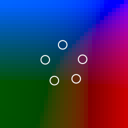

= Monte-Carlo Theme

An Emacs theme to test your luck.

== How does it work?

The theme randomly picks five colors in some pattern (randomly picked
from two patterns) in the
https://en.wikipedia.org/wiki/HCL_color_space[HCL color space]. It
also randomly decides whether you like light or dark theme today.

The colors are then translated into LAB space, and then XYZ, and then
linear RGB, and finally sRGB. (Because I am too lazy to calculate a
direct formula from HCL to sRGB. Also this way it doesn’t look as
low-effort as it is. :-)

You can use `monte-carlo-theme-create-color-chart` and
`monte-carlo-theme-create-color-sheet` to visualize the current set of
colors. Below is an example of a color chart.

_*If Emacs decides to use Imagemagick for SVG support, it would not be
able to view an SVG buffer that is not associated with a file.
Therefore the color chart and color sheet would not work._

== Configuration

Check out the customization group. I do plan to add more customizable
variables, as there are a lot of thing one can tune to achieve the
desired balance between “suprise” and readability.
